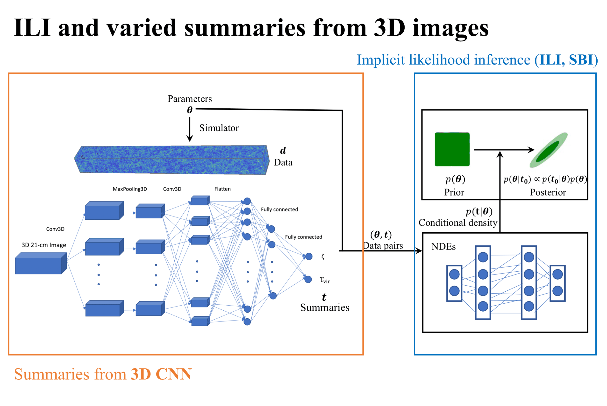

# 21cmDELFI

This package is for the density estimation likelihood inference (DELFI) with 21 cm statistics like the power spectrum (21cmDELFI-PS, [Zhao et al. 2022a](http://arxiv.org/abs/2203.15734)), 3D CNN summaries (DELFI-3D CNN, [Zhao et al. 2022b](https://ui.adsabs.harvard.edu/abs/2022ApJ...926..151Z/abstract)), and solid harmonic wavelet transform (WST)(dubbed 3D ScatterNet, [Zhao et al. 2023](https://arxiv.org/abs/2310.17602)). The main module of DELFI is heavily borrowed from the [pydelfi](https://github.com/justinalsing/pydelfi) package, mainly described in [Alsing, Charnock, Feeney and Wandelt 2019](https://arxiv.org/abs/1903.00007), with minor changes in `delfi.py`. The validations of the posteriors are partly borrowed from [galpo](https://github.com/smucesh/galpro/), which is based on [S. Mucesh et al. 2021](https://academic.oup.com/mnras/article/502/2/2770/6105325). The other validation tool is based on [Diana Harrison et al. 2015](https://academic.oup.com/mnras/article/451/3/2610/1186451). If you use this code, please consider citing these papers.
<p align = "center">

</p>
<p align = "center">
</p>

**Update 2023.10.26**

[Kymatio](https://github.com/kymatio/kymatio) is required to install for the analysis from solid harmonic wavelet scattering transform (WST) with DELFI ([Zhao et al. 2023](https://arxiv.org/abs/2310.17602)). Check the `tutural` directory for scripts to calculate solid harmonic WST as training data.

**Installation:**

The code is tested with python3 (3.7) and the [tensorflow](https://www.tensorflow.org) (1.15) in a separate conda environment. Other dependencies:<br>
[getdist](http://getdist.readthedocs.io/en/latest/)<br>
[emcee](http://dfm.io/emcee/current/) (>=3.0.2)<br>
[tqdm](https://github.com/tqdm/tqdm)<br>
[mpi4py](https://mpi4py.readthedocs.io/en/stable/) (if MPI is required)<br>

To install the dependencies and this package, you can first run
```
pip install tensorflow==1.15
```
then clone the repo and run `python setup.py install` from the top-level directory.<br>
Another suggeted way to install mpi4py if some problem happens: 
```
conda install -c anaconda mpi4py
```

For the active learning (under development) with the 21 cm power spectrum, the implemented example has the other two dependencies:<br>
[21cmFAST](https://github.com/andreimesinger/21cmFAST) <br>
[21cmSense](https://github.com/steven-murray/21cmSense) <br>

**Documentation and tutorials:** 

If you want to implement your own 21cm signal, please check the scripts in the `tutural` directory, where you can replace the data with your own.<br> 

For validation of both marginal and joint posteriors, you can check the `Diagnostics.ipynb` under the `tutural` directory.

Comparing to the [pydelfi](https://github.com/justinalsing/pydelfi) package, the `delfi.py` in this repo has the following minor changes:
1. Add a free parameter `n_noise` under the `pydelfi` directory for the active learning, . This new parameter describes the number of realizations of noise for each simulation of signal. You can refer to `Active_learning.py` under the `tutorial` directory to play with your own application of active learning.
2. Add two `emcee_sample` functions that can output the posterior samples from individual neural density estimator in an ensemble.
3. Output the full chains together with the corresponding log probabilities, in order to evaluate the probabilistic HPD calibration (for the validation of posteriors).
4. For the `log_likelihood_staked` function, we watch out for overflow if the likelihood has extreme number, in which case you can force it's type to be `np.float64`.

You may also want to compress the 21 cm images into different low-dimensional summaries. For example, in [this repository](https://github.com/Xiaosheng-Zhao/DELFI-3DCNN), we present the code used to train a 3DCNN [(Zhao et al. 2022b)](https://arxiv.org/abs/2105.03344) as the data compressor.

The main documentation of [pydelfi](https://github.com/justinalsing/pydelfi) can be found **[here](https://pydelfi.readthedocs.io/en/latest/)**.

